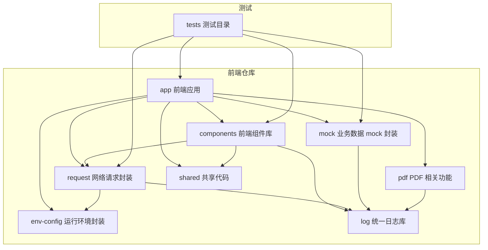
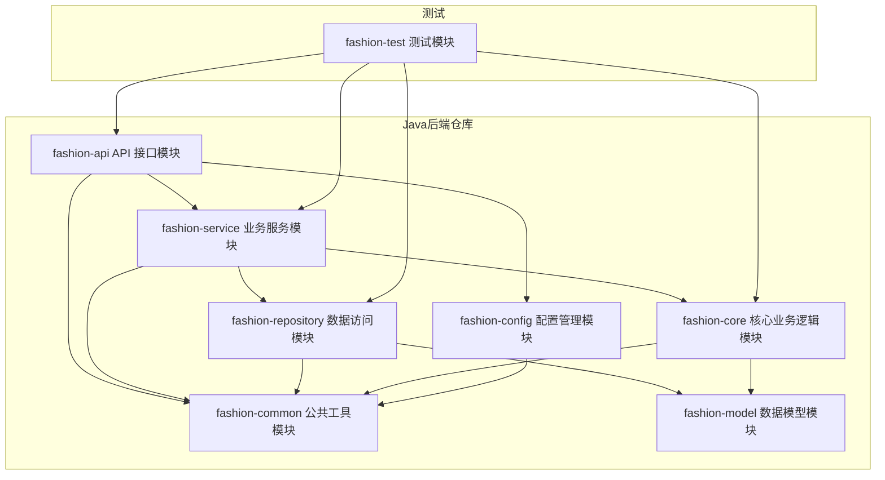
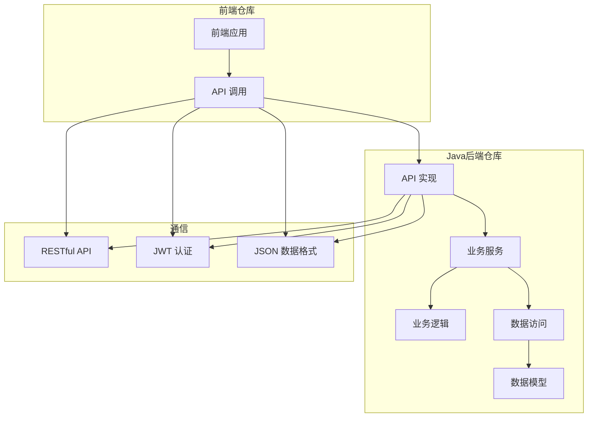

# 穿搭系统依赖关系图

## 1. 前端仓库依赖图

## 2. Java后端仓库依赖图

## 3. 仓库间依赖关系

## 4. 依赖关系说明

### 4.1 前端仓库依赖关系

1. **app 前端应用**
   - 依赖：components、request、mock、env-config、pdf、shared
   - 说明：前端应用是最终的用户界面，需要使用所有其他模块来实现完整功能

2. **components 前端组件库**
   - 依赖：request、shared、log
   - 说明：组件库需要网络请求功能来获取数据，需要共享代码来保持一致性，需要日志功能来记录错误

3. **request 网络请求封装**
   - 依赖：log、env-config
   - 说明：网络请求需要日志功能来记录请求和响应，需要环境配置来获取 API 地址

4. **mock 业务数据 mock 封装**
   - 依赖：log
   - 说明：mock 模块需要日志功能来记录 mock 数据的使用情况

5. **pdf PDF 相关功能**
   - 依赖：log
   - 说明：PDF 模块需要日志功能来记录 PDF 生成和解析的过程

6. **shared 共享代码**
   - 依赖：无
   - 说明：共享代码是基础模块，被其他模块依赖

7. **log 统一日志库**
   - 依赖：无
   - 说明：日志库是基础模块，被其他模块依赖

8. **env-config 运行环境封装**
   - 依赖：无
   - 说明：环境配置是基础模块，被其他模块依赖

### 4.2 Java后端仓库依赖关系

1. **fashion-api API 接口模块**
   - 依赖：fashion-service、fashion-common、fashion-config
   - 说明：API 接口模块需要业务服务来处理业务逻辑，需要公共工具来处理通用功能，需要配置管理来获取配置信息

2. **fashion-service 业务服务模块**
   - 依赖：fashion-core、fashion-repository、fashion-common
   - 说明：业务服务模块需要核心业务逻辑来实现业务规则，需要数据访问模块来操作数据，需要公共工具来处理通用功能

3. **fashion-repository 数据访问模块**
   - 依赖：fashion-model、fashion-common
   - 说明：数据访问模块需要数据模型来定义数据结构，需要公共工具来处理通用功能

4. **fashion-core 核心业务逻辑模块**
   - 依赖：fashion-model、fashion-common
   - 说明：核心业务逻辑模块需要数据模型来定义数据结构，需要公共工具来处理通用功能

5. **fashion-model 数据模型模块**
   - 依赖：无
   - 说明：数据模型是基础模块，被其他模块依赖

6. **fashion-common 公共工具模块**
   - 依赖：无
   - 说明：公共工具是基础模块，被其他模块依赖

7. **fashion-config 配置管理模块**
   - 依赖：fashion-common
   - 说明：配置管理模块需要公共工具来处理通用功能

### 4.3 仓库间依赖关系

1. **前端应用 → API 实现**
   - 依赖方式：HTTP 请求
   - 说明：前端应用通过 HTTP 请求调用后端 API 接口

2. **API 实现 → 业务服务**
   - 依赖方式：方法调用
   - 说明：API 接口模块调用业务服务模块来处理业务逻辑

3. **业务服务 → 业务逻辑**
   - 依赖方式：方法调用
   - 说明：业务服务模块调用核心业务逻辑模块来实现业务规则

4. **业务服务 → 数据访问**
   - 依赖方式：方法调用
   - 说明：业务服务模块调用数据访问模块来操作数据

5. **数据访问 → 数据模型**
   - 依赖方式：类型引用
   - 说明：数据访问模块使用数据模型来定义数据结构

## 5. 依赖层次说明

### 5.1 前端仓库依赖层次

1. **底层模块**：log、env-config、shared
   - 被所有其他模块依赖
   - 不依赖其他模块

2. **中间层模块**：request、mock、pdf、components
   - 依赖底层模块
   - 被上层模块依赖

3. **顶层模块**：app
   - 依赖所有其他模块
   - 不被其他模块依赖（除了测试）

### 5.2 Java后端仓库依赖层次

1. **底层模块**：fashion-model、fashion-common
   - 被所有其他模块依赖
   - 不依赖其他模块（或仅依赖 fashion-common）

2. **中间层模块**：fashion-core、fashion-repository、fashion-config
   - 依赖底层模块
   - 被上层模块依赖

3. **上层模块**：fashion-service
   - 依赖中间层模块
   - 被顶层模块依赖

4. **顶层模块**：fashion-api
   - 依赖所有其他模块
   - 不被其他模块依赖（除了测试）

## 6. 依赖管理建议

1. **前端仓库**：
   - 使用 pnpm workspace 管理依赖
   - 避免循环依赖
   - 保持模块职责单一
   - 定期更新依赖版本

2. **Java后端仓库**：
   - 使用 Maven 管理依赖
   - 避免循环依赖
   - 保持模块职责单一
   - 定期更新依赖版本
   - 使用版本锁定避免依赖冲突

3. **仓库间**：
   - 定义清晰的 API 接口
   - 使用版本控制确保 API 兼容性
   - 实现错误处理和重试机制
   - 考虑使用 API 网关统一管理 API 调用
