# 第三章配套图表 PlantUML 代码

使用方式：复制各代码块到 https://www.plantuml.com/plantuml/uml/ 或 VS Code PlantUML 插件渲染后截图插入论文。

---

## 图3-1 系统角色与核心用例图（总览）

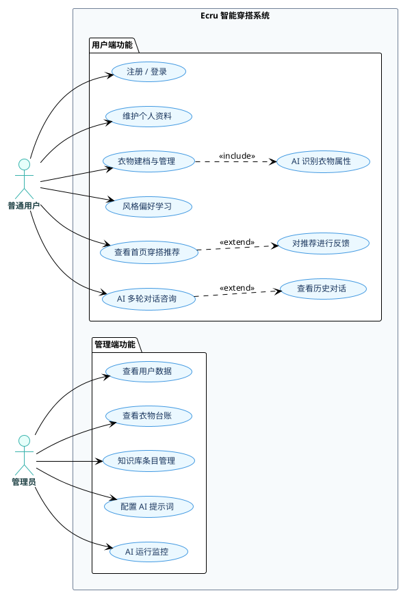

---

## 图3-2 账号管理用例图

```plantuml
@startuml usecase_account
!theme plain
skinparam defaultFontName "SimHei"
skinparam defaultFontSize 12
skinparam usecase { BackgroundColor #ebf8ff; BorderColor #4299e1 }
skinparam actor { BackgroundColor #e6fffa; BorderColor #38b2ac; FontStyle bold }

left to right direction

actor "普通用户" as U

rectangle "账号管理" {
    usecase "用户注册"         as UC1
    usecase "用户登录"         as UC2
    usecase "刷新 Token"       as UC3
    usecase "查看个人资料"     as UC4
    usecase "修改个人资料"     as UC5
    usecase "修改头像"         as UC6
}

U --> UC1
U --> UC2
UC2 ..> UC3 : <<extend>>
U --> UC4
U --> UC5
UC5 ..> UC6 : <<extend>>
@enduml
```

---

## 图3-3 衣物管理用例图

```plantuml
@startuml usecase_clothing
!theme plain
skinparam defaultFontName "SimHei"
skinparam defaultFontSize 12
skinparam usecase { BackgroundColor #ebf8ff; BorderColor #4299e1 }
skinparam actor { BackgroundColor #e6fffa; BorderColor #38b2ac; FontStyle bold }

left to right direction

actor "普通用户" as U
actor "AI 服务"  as AI

rectangle "衣物管理" {
    usecase "上传衣物图片"       as UC1
    usecase "AI 自动识别属性"    as UC2
    usecase "手动填写属性"       as UC3
    usecase "保存衣物信息"       as UC4
    usecase "编辑衣物信息"       as UC5
    usecase "删除衣物"           as UC6
    usecase "查看衣物列表"       as UC7
    usecase "查看衣物详情"       as UC8
}

U  --> UC1
UC1 ..> UC2 : <<extend>>
UC1 ..> UC3 : <<extend>>
UC2 --> AI
UC2 ..> UC4 : <<include>>
UC3 ..> UC4 : <<include>>
U  --> UC5
U  --> UC6
U  --> UC7
UC7 ..> UC8 : <<extend>>
@enduml
```

---

## 图3-4 风格偏好用例图

```plantuml
@startuml usecase_style
!theme plain
skinparam defaultFontName "SimHei"
skinparam defaultFontSize 12
skinparam usecase { BackgroundColor #ebf8ff; BorderColor #4299e1 }
skinparam actor { BackgroundColor #e6fffa; BorderColor #38b2ac; FontStyle bold }

left to right direction

actor "普通用户" as U

rectangle "风格偏好" {
    usecase "浏览风格图片库"       as UC1
    usecase "标记喜欢 / 不喜欢"    as UC2
    usecase "跳过图片"             as UC3
    usecase "查看个人风格画像"     as UC4
    usecase "系统更新偏好模型"     as UC5
}

U  --> UC1
UC1 ..> UC2 : <<extend>>
UC1 ..> UC3 : <<extend>>
UC2 ..> UC5 : <<include>>
U  --> UC4
@enduml
```

---

## 图3-5 穿搭推荐用例图

```plantuml
@startuml usecase_outfit
!theme plain
skinparam defaultFontName "SimHei"
skinparam defaultFontSize 12
skinparam usecase { BackgroundColor #ebf8ff; BorderColor #4299e1 }
skinparam actor { BackgroundColor #e6fffa; BorderColor #38b2ac; FontStyle bold }

left to right direction

actor "普通用户" as U
actor "AI 服务"  as AI

rectangle "穿搭推荐" {
    usecase "查看首页推荐"         as UC1
    usecase "查看推荐详情"         as UC2
    usecase "对推荐评分 / 反馈"    as UC3
    usecase "AI 生成穿搭方案"      as UC4
    usecase "获取天气信息"         as UC5
}

U  --> UC1
UC1 ..> UC4 : <<include>>
UC4 --> AI
UC4 ..> UC5 : <<include>>
UC1 ..> UC2 : <<extend>>
UC2 ..> UC3 : <<extend>>
@enduml
```

---

## 图3-6 AI 对话用例图

```plantuml
@startuml usecase_chat
!theme plain
skinparam defaultFontName "SimHei"
skinparam defaultFontSize 12
skinparam usecase { BackgroundColor #ebf8ff; BorderColor #4299e1 }
skinparam actor { BackgroundColor #e6fffa; BorderColor #38b2ac; FontStyle bold }

left to right direction

actor "普通用户" as U
actor "AI 服务"  as AI

rectangle "AI 对话" {
    usecase "发起新对话"           as UC1
    usecase "发送消息"             as UC2
    usecase "穿搭咨询"             as UC3
    usecase "面料 / 知识检索"      as UC4
    usecase "查看历史对话列表"     as UC5
    usecase "查看对话详情"         as UC6
    usecase "检索知识库"           as UC7
}

U  --> UC1
UC1 ..> UC2 : <<include>>
UC2 ..> UC3 : <<extend>>
UC2 ..> UC4 : <<extend>>
UC3 --> AI
UC4 --> AI
AI ..> UC7 : <<include>>
U  --> UC5
UC5 ..> UC6 : <<extend>>
@enduml
```

---

## 图3-7 管理端用例图

```plantuml
@startuml usecase_admin
!theme plain
skinparam defaultFontName "SimHei"
skinparam defaultFontSize 12
skinparam usecase { BackgroundColor #fff5f5; BorderColor #fc8181 }
skinparam actor { BackgroundColor #fff5f5; BorderColor #e53e3e; FontStyle bold }

left to right direction

actor "管理员" as A

rectangle "管理端" {
    package "数据查看" {
        usecase "查看用户列表"       as UC1
        usecase "查看用户详情"       as UC2
        usecase "查看衣物台账"       as UC3
        usecase "查看对话日志"       as UC4
        usecase "查看穿搭记录"       as UC5
    }
    package "内容维护" {
        usecase "新增知识条目"       as UC6
        usecase "编辑知识条目"       as UC7
        usecase "删除知识条目"       as UC8
        usecase "配置 AI 提示词"     as UC9
    }
    package "运行监控" {
        usecase "查看 API 调用统计"  as UC10
        usecase "查看调用记录详情"   as UC11
    }
}

A --> UC1
UC1 ..> UC2 : <<extend>>
A --> UC3
A --> UC4
A --> UC5
A --> UC6
A --> UC7
A --> UC8
A --> UC9
A --> UC10
UC10 ..> UC11 : <<extend>>
@enduml
```

---

## 图3-8 系统整体 ER 图

```plantuml
@startuml er_full
!theme plain
skinparam defaultFontName "SimHei"
skinparam defaultFontSize 11
skinparam linetype ortho

entity "users\n用户" as users {
    * id : BIGINT <<PK>>
    --
    username : VARCHAR
    password : VARCHAR
    email : VARCHAR
    phone : VARCHAR
    avatar_url : VARCHAR
    nickname : VARCHAR
    role : VARCHAR
    gender : INT
    birthday : DATE
    status : INT
    last_login_at : DATETIME
    created_at : DATETIME
    updated_at : DATETIME
}

entity "user_settings\n用户设置" as user_settings {
    * id : BIGINT <<PK>>
    --
    * user_id : BIGINT <<FK>>
    setting_key : VARCHAR
    setting_value : VARCHAR
    created_at : DATETIME
    updated_at : DATETIME
}

entity "user_login_logs\n登录日志" as user_login_logs {
    * id : BIGINT <<PK>>
    --
    user_id : BIGINT <<FK>>
    login_type : INT
    login_ip : VARCHAR
    login_device : VARCHAR
    login_status : INT
    fail_reason : VARCHAR
    created_at : DATETIME
}

entity "user_style_archives\n风格档案" as user_style_archives {
    * id : BIGINT <<PK>>
    --
    * user_id : BIGINT <<FK>>
    temperament_type : VARCHAR
    height_cm : INT
    weight_kg : INT
    body_type : VARCHAR
    skin_tone : VARCHAR
    preferred_styles : JSON
    avoided_styles : JSON
    preferred_colors : JSON
    is_test_completed : BOOL
    created_at : DATETIME
    updated_at : DATETIME
}

entity "style_tags\n风格标签" as style_tags {
    * id : BIGINT <<PK>>
    --
    name : VARCHAR
    category : VARCHAR
    is_preset : BOOL
    description : VARCHAR
    usage_count : INT
    created_at : DATETIME
    updated_at : DATETIME
}

entity "style_images\n风格图片" as style_images {
    * id : BIGINT <<PK>>
    --
    image_url : VARCHAR
    title : VARCHAR
    style_category : VARCHAR
    is_active : BOOL
    created_at : DATETIME
    updated_at : DATETIME
}

entity "style_image_tags\n图片标签关联" as style_image_tags {
    * id : BIGINT <<PK>>
    --
    * image_id : BIGINT <<FK>>
    * style_tag_id : BIGINT <<FK>>
    confidence : DECIMAL
    created_at : DATETIME
}

entity "user_style_profiles\n用户偏好分数" as user_style_profiles {
    * id : BIGINT <<PK>>
    --
    * user_id : BIGINT <<FK>>
    * style_tag_id : BIGINT <<FK>>
    preference_score : DECIMAL
    interaction_count : INT
    updated_at : DATETIME
}

entity "user_style_preference_logs\n偏好操作日志" as user_style_preference_logs {
    * id : BIGINT <<PK>>
    --
    * user_id : BIGINT <<FK>>
    * image_id : BIGINT <<FK>>
    preference_type : INT
    created_at : DATETIME
}

entity "clothings\n衣物" as clothings {
    * id : BIGINT <<PK>>
    --
    * user_id : BIGINT <<FK>>
    name : VARCHAR
    category : VARCHAR
    sub_category : VARCHAR
    primary_color : VARCHAR
    material : VARCHAR
    style_tags : VARCHAR
    occasion_tags : VARCHAR
    season_tags : VARCHAR
    frequency_level : INT
    wear_count : INT
    image_url : VARCHAR
    purchase_price : DECIMAL
    purchase_date : DATE
    brand : VARCHAR
    source_type : VARCHAR
    ai_confidence : DECIMAL
    is_deleted : BOOL
    created_at : DATETIME
    updated_at : DATETIME
}

entity "clothing_wear_logs\n穿着日志" as clothing_wear_logs {
    * id : BIGINT <<PK>>
    --
    * clothing_id : BIGINT <<FK>>
    * user_id : BIGINT <<FK>>
    worn_at : DATE
    outfit_id : BIGINT
    weather_condition : VARCHAR
    temperature : DECIMAL
    notes : VARCHAR
    created_at : DATETIME
}

entity "outfit_advice_records\n穿搭建议记录" as outfit_advice_records {
    * id : BIGINT <<PK>>
    --
    * user_id : BIGINT <<FK>>
    input_type : INT
    location : VARCHAR
    temperature : DECIMAL
    weather_condition : VARCHAR
    season : VARCHAR
    outfit_name : VARCHAR
    outfit_description : VARCHAR
    reasoning : VARCHAR
    occasion : VARCHAR
    suitability_score : DECIMAL
    is_favorite : BOOL
    is_deleted : BOOL
    created_at : DATETIME
    updated_at : DATETIME
}

entity "outfit_items\n搭配单品" as outfit_items {
    * id : BIGINT <<PK>>
    --
    * outfit_advice_id : BIGINT <<FK>>
    clothing_id : BIGINT <<FK>>
    item_name : VARCHAR
    item_category : VARCHAR
    item_color : VARCHAR
    is_recommended : BOOL
    reason : VARCHAR
    sort_order : INT
    created_at : DATETIME
}

entity "outfit_feedback\n搭配反馈" as outfit_feedback {
    * id : BIGINT <<PK>>
    --
    * outfit_advice_id : BIGINT <<FK>>
    * user_id : BIGINT <<FK>>
    overall_rating : INT
    style_rating : INT
    practicality_rating : INT
    weather_rating : INT
    is_worn : BOOL
    feedback_text : VARCHAR
    created_at : DATETIME
    updated_at : DATETIME
}

entity "ai_conversations\nAI 会话" as ai_conversations {
    * id : BIGINT <<PK>>
    --
    * user_id : BIGINT <<FK>>
    session_id : VARCHAR
    title : VARCHAR
    context : VARCHAR
    is_active : BOOL
    message_count : INT
    created_at : DATETIME
    updated_at : DATETIME
}

entity "ai_chat_messages\nAI 消息" as ai_chat_messages {
    * id : BIGINT <<PK>>
    --
    * conversation_id : BIGINT <<FK>>
    * user_id : BIGINT <<FK>>
    role : VARCHAR
    content : TEXT
    message_type : VARCHAR
    recommendations : TEXT
    context_snapshot : TEXT
    created_at : DATETIME
}

entity "ai_api_call_record\nAI 调用记录" as ai_api_call_record {
    * id : BIGINT <<PK>>
    --
    scene : VARCHAR
    model : VARCHAR
    request_id : VARCHAR
    user_id : BIGINT <<FK>>
    status : TINYINT
    response_time : BIGINT
    input_tokens : INT
    output_tokens : INT
    total_tokens : INT
    created_at : DATETIME
    create_date : VARCHAR
}

entity "ai_prompt_settings\nAI 提示词配置" as ai_prompt_settings {
    * id : BIGINT <<PK>>
    --
    setting_key : VARCHAR
    setting_value : LONGTEXT
    description : VARCHAR
    updated_by : BIGINT <<FK>>
    created_at : DATETIME
    updated_at : DATETIME
}

' ---- 关系 ----
users           ||--o{ user_settings              : "1..N"
users           ||--o{ user_login_logs            : "1..N"
users           ||--o|  user_style_archives       : "1..1"
users           ||--o{ user_style_profiles        : "1..N"
users           ||--o{ user_style_preference_logs : "1..N"
users           ||--o{ clothings                  : "1..N"
users           ||--o{ clothing_wear_logs         : "1..N"
users           ||--o{ outfit_advice_records      : "1..N"
users           ||--o{ outfit_feedback            : "1..N"
users           ||--o{ ai_conversations           : "1..N"
users           ||--o{ ai_chat_messages           : "1..N"

style_images    ||--o{ style_image_tags           : "1..N"
style_tags      ||--o{ style_image_tags           : "1..N"
style_tags      ||--o{ user_style_profiles        : "1..N"
style_images    ||--o{ user_style_preference_logs : "1..N"

clothings       ||--o{ clothing_wear_logs         : "1..N"
clothings       ||--o{ outfit_items               : "0..N"

outfit_advice_records ||--o{ outfit_items         : "1..N"
outfit_advice_records ||--o{ outfit_feedback      : "1..N"

ai_conversations ||--o{ ai_chat_messages          : "1..N"
@enduml
```

---

## 图3-9 用户模块局部 ER 图

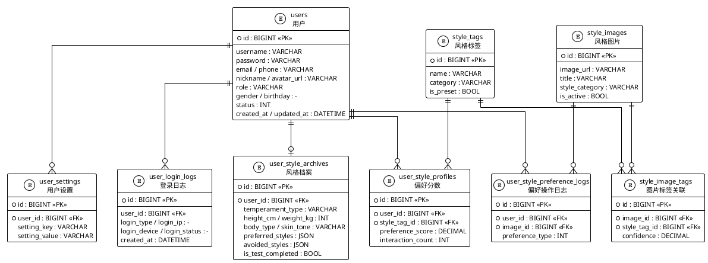

---

## 图3-10 衣物与穿搭模块局部 ER 图

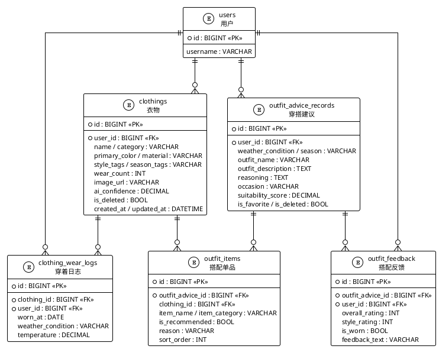

---

## 图3-11 AI 对话与监控模块局部 ER 图

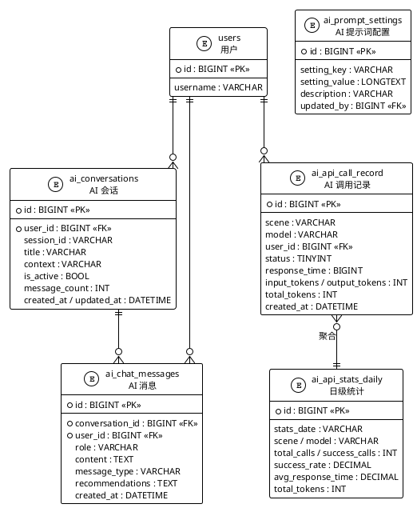

---

## 图5-1 用户注册时序图

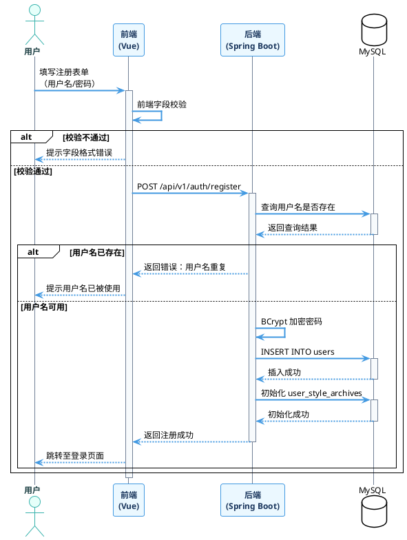

---

## 图5-3 用户登录时序图

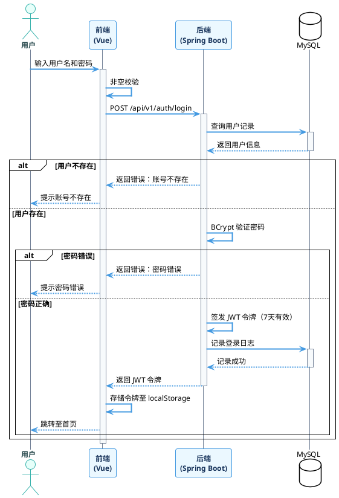

---

## 图5-6 衣物录入时序图

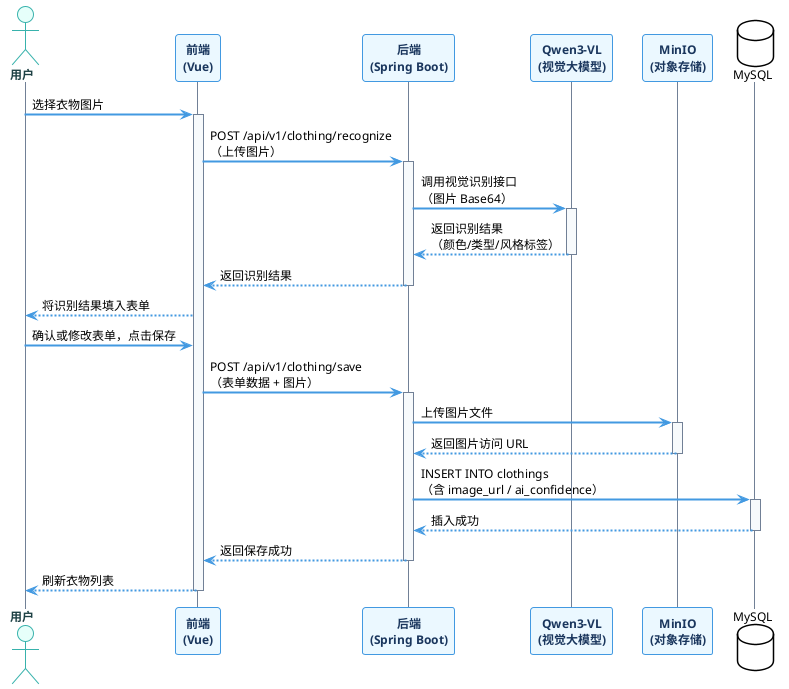

---

## 图5-10 风格偏好选择时序图

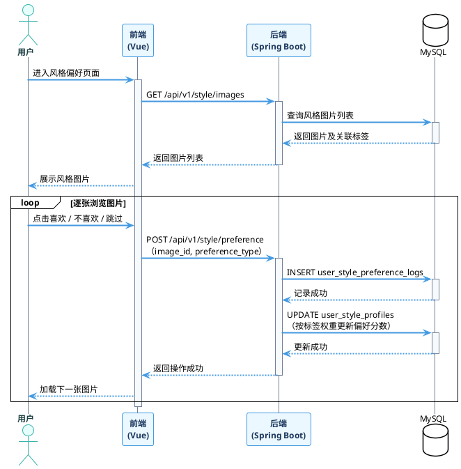

---

## 图5-13 穿搭推荐生成时序图

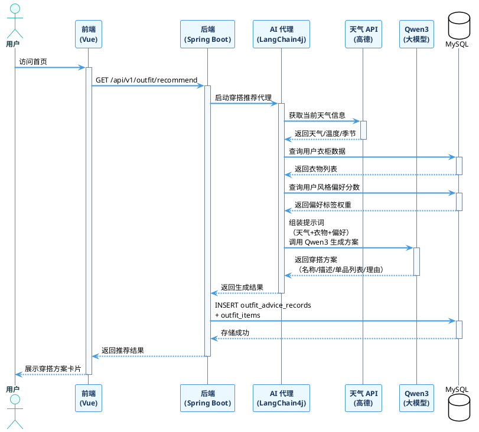

---

## 图5-17 AI 对话时序图

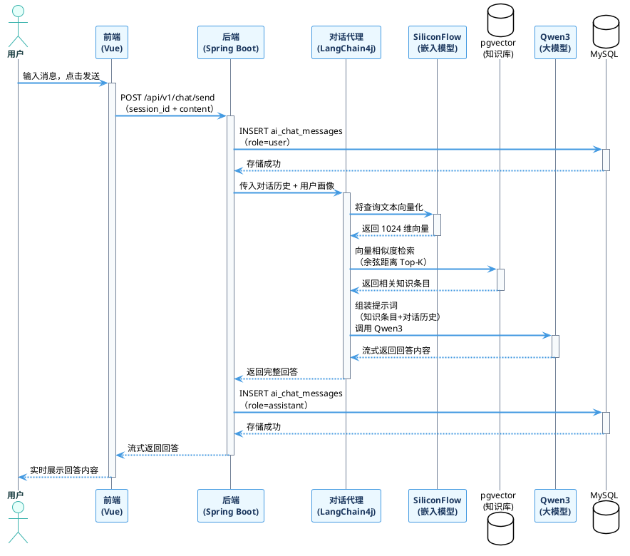

---

## 图4-2 系统逻辑架构图

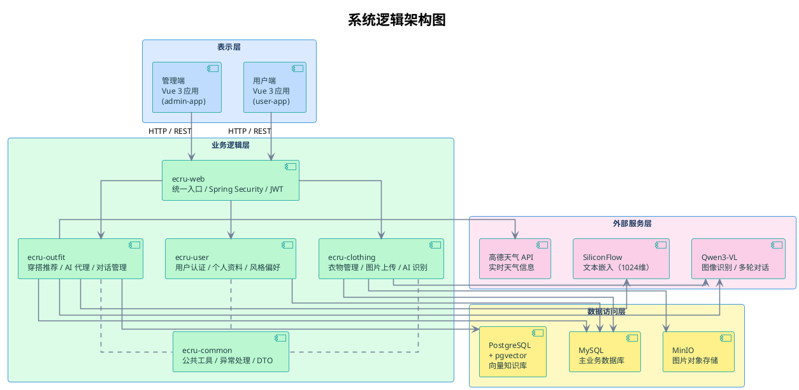

---

## 图4-3 系统技术架构图

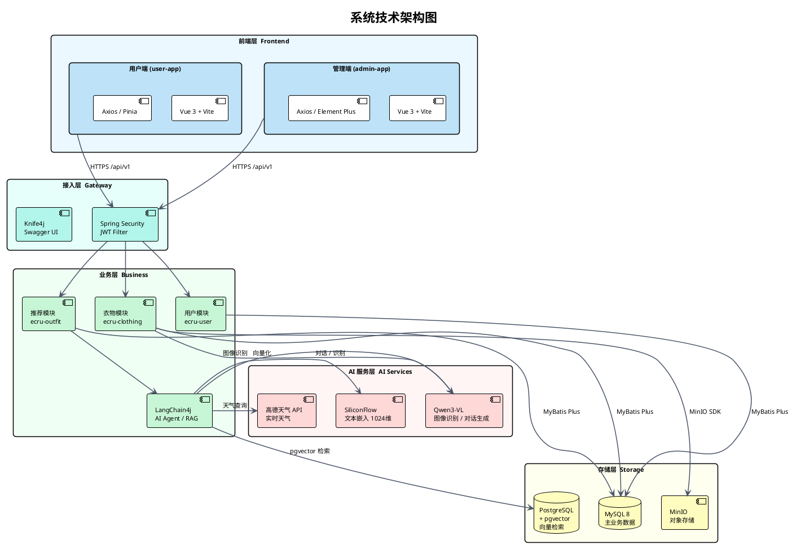

---

## 图4-3 系统功能架构图

```plantuml
@startuml arch_func
!theme plain
skinparam defaultFontName "SimHei"
skinparam defaultFontSize 11
skinparam nodesep 20
skinparam ranksep 30
skinparam rectangle {
    RoundCorner 4
    BorderThickness 1.2
}

' ── 第一层 ──
rectangle "Ecru\n智能穿搭\n系统" as SYS #2b6cb0

' ── 第二层 ──
rectangle "普\n通\n用\n户" as U #4299e1
rectangle "管\n理\n员" as A #38b2ac

' ── 第三层 用户侧 ──
rectangle "账\n号\n管\n理" as M1 #bee3f8
rectangle "衣\n物\n管\n理" as M2 #bee3f8
rectangle "风\n格\n偏\n好" as M3 #bee3f8
rectangle "穿\n搭\n推\n荐" as M4 #bee3f8
rectangle "A\nI\n对\n话" as M5 #bee3f8

' ── 第三层 管理侧 ──
rectangle "用\n户\n管\n理" as MA1 #b2f5ea
rectangle "衣\n物\n台\n账" as MA2 #b2f5ea
rectangle "知\n识\n库\n管\n理" as MA3 #b2f5ea
rectangle "系\n统\n配\n置" as MA4 #b2f5ea
rectangle "A\nI\n监\n控" as MA5 #b2f5ea

' ── 第四层 用户侧功能 ──
rectangle "注\n册\n/\n登\n录" as F11 #ebf8ff
rectangle "查\n看\n个\n人\n资\n料" as F12 #ebf8ff
rectangle "修\n改\n个\n人\n资\n料" as F13 #ebf8ff
rectangle "修\n改\n头\n像" as F14 #ebf8ff

rectangle "上\n传\n衣\n物\n图\n片" as F21 #ebf8ff
rectangle "A\nI\n识\n别\n属\n性" as F22 #ebf8ff
rectangle "手\n动\n填\n写\n/\n编\n辑" as F23 #ebf8ff
rectangle "删\n除\n衣\n物" as F24 #ebf8ff
rectangle "查\n看\n衣\n物\n列\n表" as F25 #ebf8ff

rectangle "浏\n览\n风\n格\n图\n片\n库" as F31 #ebf8ff
rectangle "标\n记\n喜\n欢\n/\n不\n喜\n欢" as F32 #ebf8ff
rectangle "查\n看\n风\n格\n画\n像" as F33 #ebf8ff

rectangle "查\n看\n首\n页\n推\n荐" as F41 #ebf8ff
rectangle "查\n看\n推\n荐\n详\n情" as F42 #ebf8ff
rectangle "评\n分\n与\n反\n馈" as F43 #ebf8ff

rectangle "发\n起\n新\n对\n话" as F51 #ebf8ff
rectangle "多\n轮\n穿\n搭\n咨\n询" as F52 #ebf8ff
rectangle "查\n看\n历\n史\n对\n话" as F53 #ebf8ff

' ── 第四层 管理侧功能 ──
rectangle "查\n看\n用\n户\n列\n表" as FA11 #e6fffa
rectangle "查\n看\n用\n户\n详\n情" as FA12 #e6fffa

rectangle "查\n看\n全\n量\n衣\n物" as FA21 #e6fffa
rectangle "按\n用\n户\n筛\n选" as FA22 #e6fffa

rectangle "新\n增\n知\n识\n条\n目" as FA31 #e6fffa
rectangle "编\n辑\n知\n识\n条\n目" as FA32 #e6fffa
rectangle "删\n除\n知\n识\n条\n目" as FA33 #e6fffa

rectangle "配\n置\nA\nI\n提\n示\n词" as FA41 #e6fffa

rectangle "查\n看\n调\n用\n统\n计" as FA51 #e6fffa
rectangle "查\n看\n对\n话\n日\n志" as FA52 #e6fffa

' ── 连线（无箭头） ──
SYS -  U
SYS -  A

U -  M1
U -  M2
U -  M3
U -  M4
U -  M5

M1 -  F11
M1 -  F12
M1 -  F13
M1 -  F14

M2 -  F21
M2 -  F22
M2 -  F23
M2 -  F24
M2 -  F25

M3 -  F31
M3 -  F32
M3 -  F33

M4 -  F41
M4 -  F42
M4 -  F43

M5 -  F51
M5 -  F52
M5 -  F53

A -  MA1
A -  MA2
A -  MA3
A -  MA4
A -  MA5

MA1 -  FA11
MA1 -  FA12

MA2 -  FA21
MA2 -  FA22

MA3 -  FA31
MA3 -  FA32
MA3 -  FA33

MA4 -  FA41

MA5 -  FA51
MA5 -  FA52

@enduml
```
