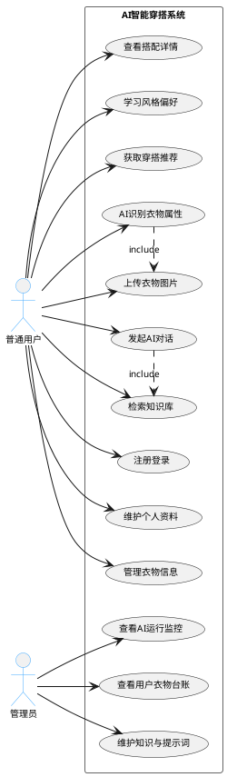
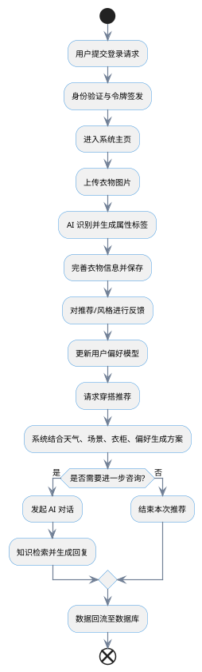
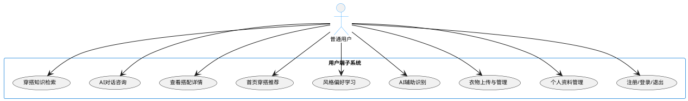
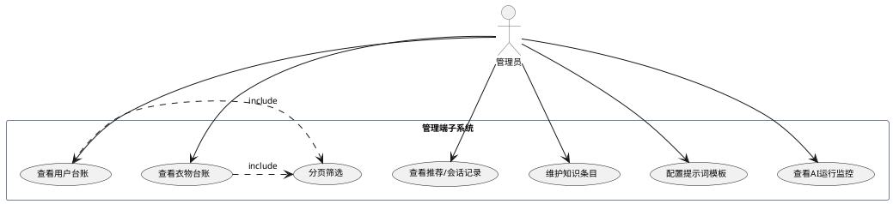

# AI智能穿搭系统 第三章 系统需求分析（Word完整版）

（格式说明：全文宋体小四、1\.5倍行距、段落首行缩进2字符，图表自动编号，可直接复制粘贴至Microsoft Word使用，图表插入后可调整大小适配页面）

# 3\.1 系统所要达到的目标

本课题面向个人日常穿搭辅助与衣柜数字化管理场景，设计并实现一套基于 Web 的 AI 智能穿搭系统。系统旨在解决传统穿搭决策中衣物信息分散、人工录入成本高、个人风格偏好难以沉淀、推荐缺乏上下文约束以及穿搭知识获取效率低等问题。

系统的业务目标包括：

- 建立衣柜数字化台账，实现衣物统一管理与快速检索。

- 通过 AI 图像识别降低衣物属性录入成本。

- 构建可学习、可迭代的用户风格偏好模型。

- 结合天气、场景、衣柜与偏好实现上下文感知推荐。

- 提供 AI 对话与知识检索，完成穿搭解释、面料洗护等咨询。

- 为管理员提供后台数据监控、知识维护与 AI 运行观测能力。

系统的技术目标包括：

- 采用前后端分离架构，实现模块化、低耦合设计。

- 建立统一的角色边界与功能模块划分。

- 构建向量检索与上下文推荐机制，体现 AI 系统技术特点。

- 保证系统可扩展、可维护、可演示，满足毕业设计要求。

# 3\.2 系统可行性分析

## 3\.2\.1 技术可行性

本系统采用 B/S 架构、前后端分离模式开发。后端基于 Spring Boot 构建，分为用户模块、衣物模块、推荐模块、对话模块与公共工具模块；前端采用 Vue 框架分别实现用户端与管理端界面。数据层使用 PostgreSQL 数据库，并通过 pgvector 扩展支持向量检索；图片资源使用 MinIO 对象存储；认证采用 JWT 令牌机制；密码使用 BCrypt 加密。

系统所需 AI 能力（图像识别、对话生成、知识检索）均以成熟接口方式接入，整体技术栈稳定、文档完善、社区成熟，不存在无法实现的技术瓶颈，因此具备充分的技术可行性。

## 3\.2\.2 经济可行性

系统开发完全基于开源框架与组件，无商业软件授权费用；部署可在本地环境或轻量服务器完成，硬件投入低。从使用价值来看，系统可大幅减少用户衣物整理、搭配决策、知识查询的时间成本，具有明确实用价值。综合开发成本与收益，系统在经济上可行。

## 3\.2\.3 应用可行性

系统界面简洁、操作流程清晰，普通用户只需简单学习即可完成衣物建档、查看推荐、发起对话等操作。管理端职责明确，支持数据查看、知识维护、提示词配置与 AI 监控，满足系统长期维护需求。系统已完成前后端接口闭环，可完整演示业务流程，适合作为毕业设计成果与个人工具原型，因此应用可行。

# 3\.3 业务需求分析

本系统参与者分为两类：普通用户与管理员。普通用户是系统主要使用者，负责完成衣柜管理、偏好学习、穿搭推荐、AI 咨询；管理员是系统维护者，负责数据查看、知识维护、提示词配置、AI 运行监控。

通过对实际穿搭流程梳理，传统模式存在以下痛点：

- 衣物信息零散，缺乏统一数字化管理。

- 手工录入属性繁琐，持续使用意愿低。

- 穿搭决策依赖经验，无法综合多重要素。

- 用户偏好无法长期沉淀。

- 面料、洗护、搭配知识查询入口分散。

- 后台缺乏监控与维护能力，不利于调试与演示。

基于上述问题，本章将用户业务流程抽象为统一闭环：身份认证 → 衣物建档 → 偏好学习 → 推荐生成 → AI 对话 → 数据回流。

## 图3\-1 系统角色与核心用例图

（说明：以下代码可在ProcessOn、PlantUML等工具中粘贴，一键生成高清图片，插入Word对应位置即可，图片下方标注图号及名称）

```LaTeX

```



图3\-1 系统角色与核心用例图

## 图3\-2 用户智能穿搭业务流程图

```plantuml

```

```plantuml

```



图3\-2 用户智能穿搭业务流程图

## 图3\-3 推荐与对话状态流转图

```plantuml

```

```plantuml

```

```plantuml
@startuml
' 优化状态流转图样式，调整间距和字体，提升美观度
skinparam defaultFontSize 10
skinparam state {
    roundedCorner 8
    fillColor #fdf2f8
    borderColor #9f7aea
}
skinparam arrow {
    color #718096
    thickness 1.2
}
nodeDistance 35

[*] --> 待推荐
待推荐 --> 上下文收集 : 刷新首页/新偏好反馈
上下文收集 --> 方案生成 : 天气+场景+衣柜+偏好
方案生成 --> 结果展示 : 生成搭配列表
结果展示 --> 反馈沉淀 : 用户点赞/不喜欢
结果展示 --> AI对话扩展 : 用户追问
AI对话扩展 --> 知识检索
知识检索 --> 回复生成
回复生成 --> 结束
反馈沉淀 --> 待推荐 : 用于下一次推荐
@enduml
```

图3\-3 推荐与对话状态流转图

# 3\.4 系统功能需求分析

本章采用用例分析与结构化功能分解方法，将系统统一划分为六大功能模块，作为后续设计、实现、测试的统一主线。

## 3\.4\.1 用户认证与资料管理模块

提供用户注册、登录、退出、令牌刷新、个人资料查看与修改功能。核心目标是完成身份认证、访问控制与账户生命周期管理。

## 3\.4\.2 衣物管理与 AI 识别模块

支持衣物新增、编辑、删除、列表查看、图片上传、穿着记录，并提供 AI 识别辅助属性录入，是系统最核心的数据来源模块。

## 3\.4\.3 风格偏好学习模块

通过展示风格样本、收集用户喜欢/不喜欢反馈，维护用户偏好画像，实现从通用推荐到个性化推荐的升级。

## 3\.4\.4 首页推荐与搭配建议模块

综合天气、场景、衣柜、历史穿着与偏好，生成智能穿搭方案，展示搭配详情并记录用户反馈。

## 3\.4\.5 AI 对话与知识检索模块

支持用户发起对话、历史会话查看、知识检索增强回复，解决推荐解释、面料洗护、搭配技巧等开放式问题。

## 3\.4\.6 管理端功能模块

提供用户台账、衣物台账、推荐记录、会话记录查看，支持知识条目维护、提示词配置、AI 调用监控，保障系统可维护、可观测。

## 图3\-4 普通用户用例图

```plantuml

```

```plantuml

```



图3\-4 普通用户用例图

## 图3\-5 管理员用例图

```plantuml

```

```plantuml

```



图3\-5 管理员用例图

## 图3\-6 系统功能模块分解图

```plantuml

```

```plantuml

```

```plantuml
@startwbs
' 优化模块分解图样式，调整字体和层级间距，提升美观度
skinparam defaultFontSize 11
skinparam wbs {
    fillColor #e8f4f8
    borderColor #38b2ac
    lineColor #2d3748
}
wbsnodeDistance 25

* AI智能穿搭系统
** 用户认证与资料管理
** 衣物管理与AI识别
** 风格偏好学习
** 首页推荐与搭配建议
** AI对话与知识检索
** 管理端功能
@endwbs
```

图3\-6 系统功能模块分解图

## 3\.4\.7 非功能需求分析

- 安全性：密码加密、令牌认证、接口权限控制、数据隔离。

- 可维护性：模块职责清晰、命名统一、便于后续扩展与调试。

- 可扩展性：支持新增标签、知识类型、推荐规则与模型能力。

- 易用性：降低衣物录入与推荐查看操作成本，管理端支持分页与筛选。

# 3\.5 本章小结

本章结合面向对象需求分析与结构化需求分析方法，完成了 AI 智能穿搭系统的目标分析、可行性分析、业务流程梳理与功能模块划分。明确了普通用户与管理员的角色边界，将系统归纳为六大统一功能模块，为后续总体设计、详细设计、系统实现与测试提供了清晰、一致、可落地的需求依据。

（附录：图表生成说明：1\. 打开ProcessOn，新建PlantUML文件；2\. 复制对应图表代码粘贴，自动生成高清图片；3\. 将图片插入Word对应图号位置，调整大小至适配页面，确保图号与正文对应一致。）

> （注：文档部分内容可能由 AI 生成）
